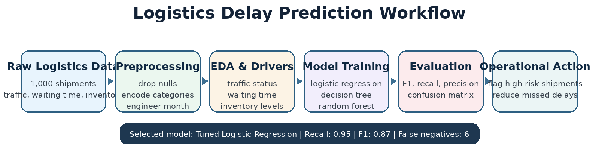
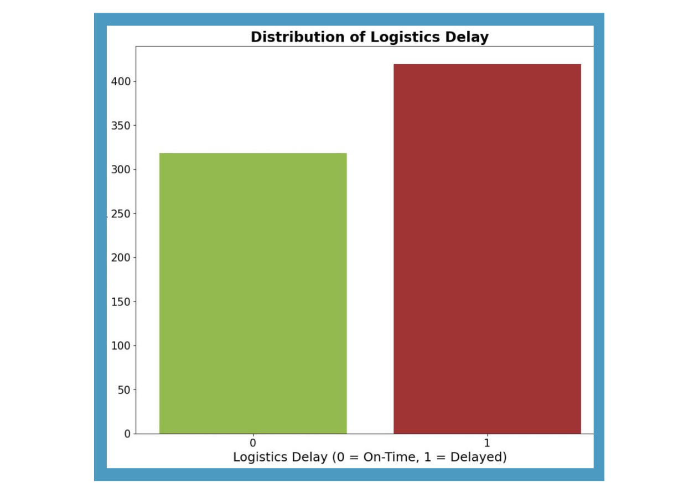
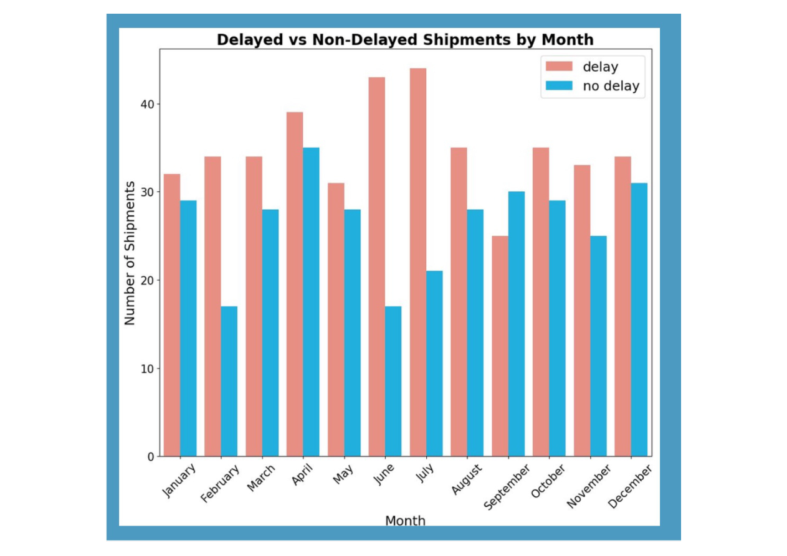
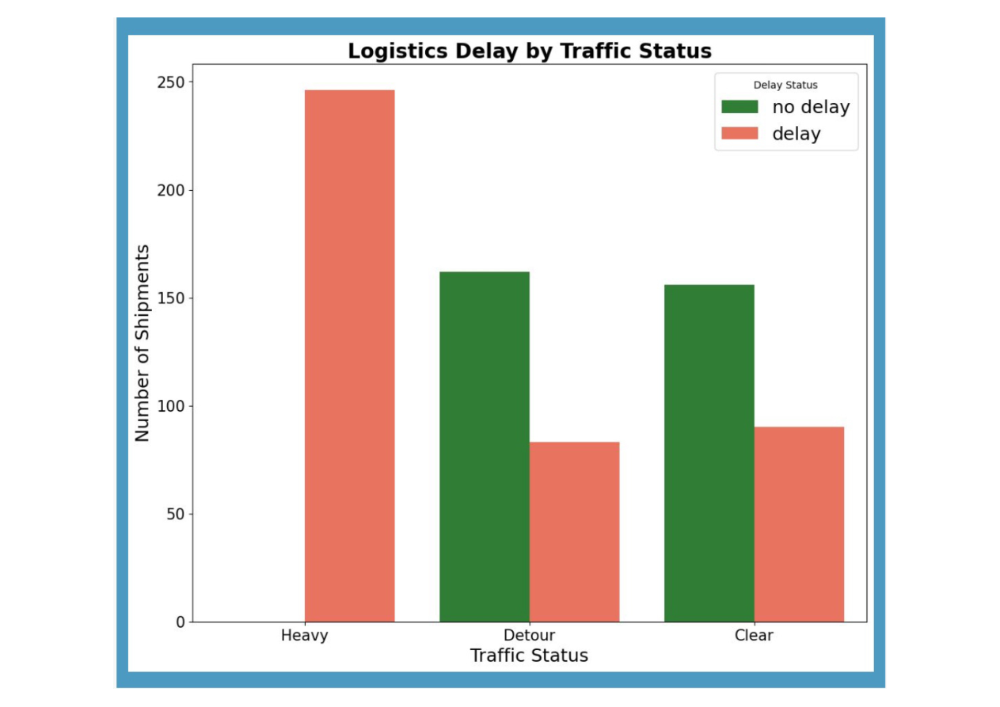
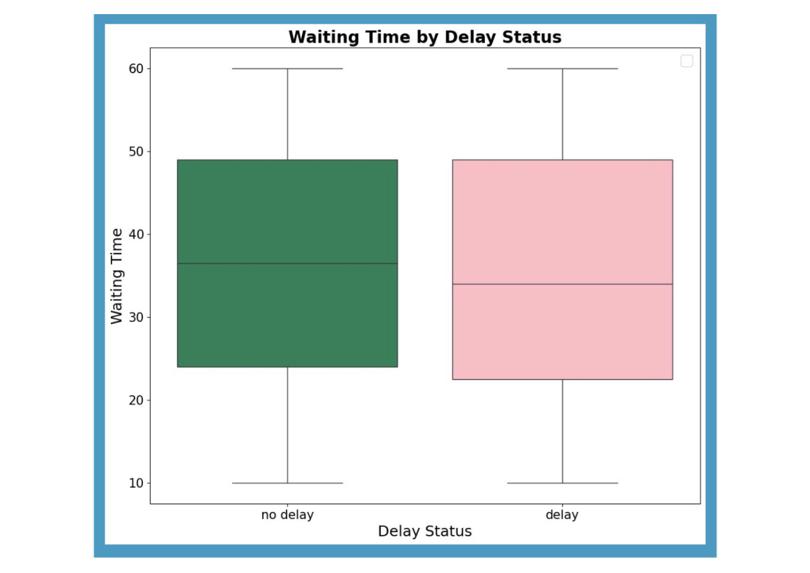
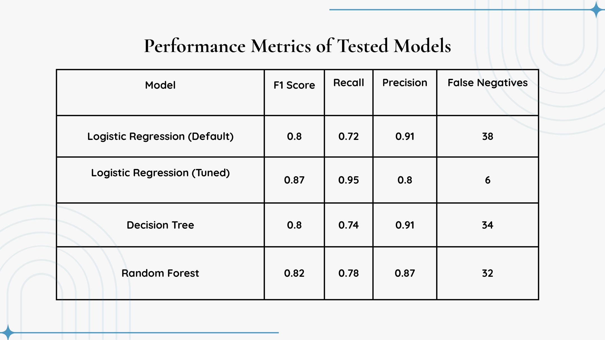
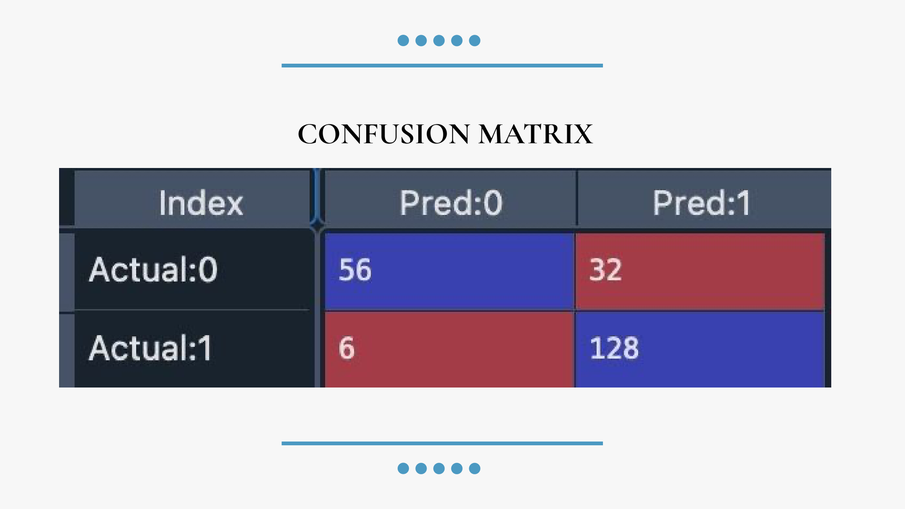

# Logistics Delay Prediction & Operational Risk Analytics

Predictive analytics project for identifying shipment delay risk and the operational drivers behind late deliveries. The project uses logistics workflow data to analyze delay patterns, compare machine learning models, and select a business-aligned model that prioritizes reducing missed delays.



## Business Problem

Shipment delays create downstream costs across dispatching, customer experience, inventory planning, and service reliability. The goal of this project is to predict whether a shipment is likely to be delayed and identify the factors most associated with late delivery so operations teams can intervene earlier.

## Dataset

- **Source:** Kaggle logistics dataset
- **Scope:** ~1,000 shipment records
- **Target variable:** `Logistics_Delay` where `0 = on-time` and `1 = delayed`
- **Key features:** traffic status, waiting time, inventory level, shipment status, temperature, humidity, demand forecast, asset utilization, and timestamp-derived month
- **Privacy / size note:** only sample CSV files are included in this repository; the full dataset should be downloaded externally and placed locally before reproduction.

## Tools & Methods

- **Languages/Libraries:** Python, Pandas, NumPy, scikit-learn, Matplotlib, Seaborn, mlxtend
- **Models Tested:** Logistic Regression, Decision Tree, Random Forest
- **Techniques:** data cleaning, feature engineering, one-hot encoding, sequential feature selection, hyperparameter tuning, threshold tuning, confusion matrix analysis
- **Evaluation Metrics:** F1-score, recall, precision, false negatives

## Exploratory Data Analysis

The dataset was cleaned, timestamp features were transformed into month-level features, and categorical variables were encoded for modeling. Exploratory analysis focused on delay distribution, monthly delay patterns, traffic conditions, and waiting-time differences between delayed and non-delayed shipments.

### Delay Distribution



Delayed shipments were more frequent than non-delayed shipments in this dataset, making delay classification a meaningful operational problem.

### Monthly Delay Trends



Delay patterns varied across months, with visible mid-year peaks. This suggests that seasonal operating conditions may affect logistics reliability.

### Traffic Conditions and Delay Risk



Heavy traffic was strongly associated with delayed shipments, making traffic status one of the most useful operational signals for delay risk.

### Waiting Time by Delay Status



Waiting time showed differences between delayed and non-delayed shipments, supporting its use as an operational risk indicator.

## Model Development

Three classification models were trained and evaluated:

1. Logistic Regression
2. Decision Tree
3. Random Forest

During early feature selection, a highly correlated traffic feature produced unrealistically strong results. To reduce overfitting risk, the feature was removed and the models were re-evaluated using a more realistic feature set.

## Model Comparison

| Model | F1 Score | Recall | Precision | False Negatives |
|---|---:|---:|---:|---:|
| Logistic Regression (Default) | 0.80 | 0.72 | 0.91 | 38 |
| Logistic Regression (Tuned Threshold) | 0.87 | 0.95 | 0.80 | 6 |
| Decision Tree | 0.80 | 0.74 | 0.91 | 34 |
| Random Forest | 0.82 | 0.78 | 0.87 | 32 |



## Final Model Selection

The tuned Logistic Regression model was selected because it minimized false negatives after lowering the decision threshold from `0.5` to `0.3`. In a logistics setting, missing a true delay can be more costly than flagging an extra shipment for review, so recall was prioritized over precision.



## Key Findings

- **Top delay drivers:** traffic status, waiting time, and inventory level
- **Traffic impact:** heavy and detour traffic conditions were strongly associated with delayed shipments
- **Inventory signal:** lower inventory levels appeared connected to higher delay risk
- **Weather variables:** temperature and humidity showed weaker relationships with delays in this dataset
- **Best model:** tuned Logistic Regression achieved **0.95 recall**, **0.87 F1-score**, and only **6 false negatives**

## Operational Recommendations

- Flag shipments with high waiting time and heavy traffic exposure for proactive review
- Integrate live traffic data into dispatching and ETA workflows
- Maintain buffer inventory during peak delay periods
- Monitor false negatives closely because missed delays carry higher operational cost

## Repository Structure

```text
logistics-delay-prediction/
├── README.md
├── assets/
│   └── figures/
│       ├── project_workflow.png
│       ├── delay_distribution.png
│       ├── monthly_delay_trends.png
│       ├── delay_by_traffic_status.png
│       ├── waiting_time_by_delay_status.png
│       ├── model_comparison_table.png
│       └── confusion_matrix_tuned_logistic.png
├── code/
│   └── logistics_delay_prediction.py
├── data/
│   └── sample/
│       ├── logistics_raw_sample.csv
│       └── logistics_clean_sample.csv
├── docs/
│   └── logistics-delay-prediction.pdf
└── requirements.txt
```

## How to Reproduce

1. Clone the repository.
2. Install dependencies:

```bash
pip install -r requirements.txt
```

3. Download the full dataset from the external source and place it in the project directory.
4. Update the dataset path in `code/logistics_delay_prediction.py` if needed.
5. Run:

```bash
python code/logistics_delay_prediction.py
```

## Future Improvements

- Add SHAP values or partial dependence plots for model explainability
- Integrate real-time traffic or ETA API data
- Expand the dataset with route distance, carrier, region, and warehouse congestion features
- Deploy a Streamlit dashboard for interactive shipment risk scoring
